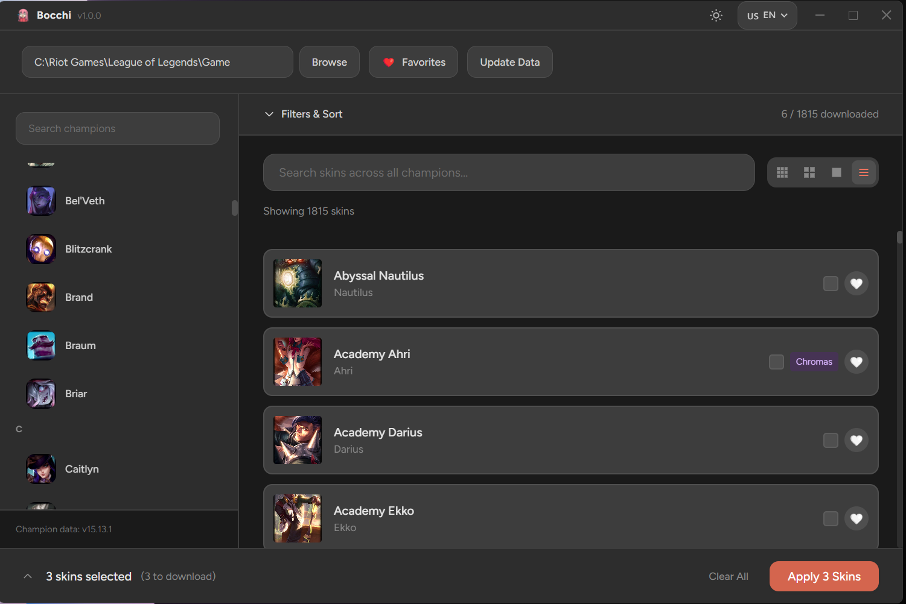

# Bocchi - League of Legends Skin Changer

<div align="center">
  
  
  [](LICENSE)
  [](https://github.com/hoangvu12/bocchi/releases)
  [](https://www.electronjs.org/)
  [](https://react.dev/)
  [](https://discord.gg/frXDBTe4FW)
</div>

## 📖 Overview

Bocchi is a modern, user-friendly desktop application for changing League of Legends skins. Built with Electron and React.

## ✨ Features

- 🎨 **Browse & Download Skins** - Explore a vast collection of skins
- 🔍 **Smart Search & Filters** - Find skins quickly with filtering options
- 💾 **Automatic Installation** - One-click skin installation
- 🌏 **Multi-language Support** - Available in English and Vietnamese (and more in the future)
- ⭐ **Favorites System** - Save your favorite skins for quick access
- 🔄 **Auto-update** - Stay up-to-date with automatic updates
- 🎮 **Game Detection** - Automatically detects your League of Legends installation

## 📸 Screenshots



## 🚀 Installation

### Download

1. Go to the [Releases](https://github.com/hoangvu12/bocchi/releases) page
2. Download the latest `Bocchi-Setup-x.x.x.exe`
3. Run the installer and follow the setup wizard

## 🛠️ Development

### Prerequisites

- Node.js 20+
- pnpm (recommended) or npm
- Windows (for full functionality)

### Setup

```bash
# Clone the repository
git clone https://github.com/hoangvu12/bocchi.git
cd bocchi

# Install dependencies
pnpm install

# Run in development mode
pnpm dev

# Build for production
pnpm build:win
```

### Technologies

- **Frontend**: React 19, TypeScript, Tailwind CSS
- **Backend**: Electron 33, Node.js
- **State Management**: Jotai
- **Build Tool**: Vite
- **Package Manager**: pnpm
- **Mod Tools**: cslol-tools integration

## 🔧 Configuration

Bocchi stores its configuration and data in:

- **Windows**: `%APPDATA%/bocchi`

### Settings

You can customize various aspects through the settings menu:

- Language preference
- Download location
- Theme settings
- Update preferences

## 🤝 Contributing

Contributions are welcome! Please feel free to submit a Pull Request.

1. Fork the repository
2. Create your feature branch (`git checkout -b feature/AmazingFeature`)
3. Commit your changes (`git commit -m 'Add some AmazingFeature'`)
4. Push to the branch (`git push origin feature/AmazingFeature`)
5. Open a Pull Request

## 📝 License

This project is licensed under the MIT License - see the [LICENSE](LICENSE) file for details.

## 🙏 Acknowledgments

- [cslol-manager](https://github.com/LeagueToolkit/cslol-manager/) - Core modding tools
- [lol-skins](https://github.com/darkseal-org/lol-skins) - A comprehensive collection of League of Legends skins available for custom use.

## ⚠️ Disclaimer

This project is not affiliated with Riot Games. League of Legends and Riot Games are registered trademarks of Riot Games, Inc.

Use at your own risk. Skins are client-side only and do not provide any competitive advantage.

## 📧 Contact

- GitHub Issues: [Create an issue](https://github.com/hoangvu12/bocchi/issues)
- Discord Server: [Join our community](https://discord.gg/frXDBTe4FW)
- GitHub Repository: [Star on GitHub](https://github.com/hoangvu12/bocchi)

## 💝 Support

If you find Bocchi helpful and want to support its development:

[](https://ko-fi.com/hoangvu12)

Your support helps keep the project alive and motivates continued development!

---

<div align="center">
  Made with ❤️ by <a href="https://github.com/hoangvu12">hoangvu12</a>
</div>
